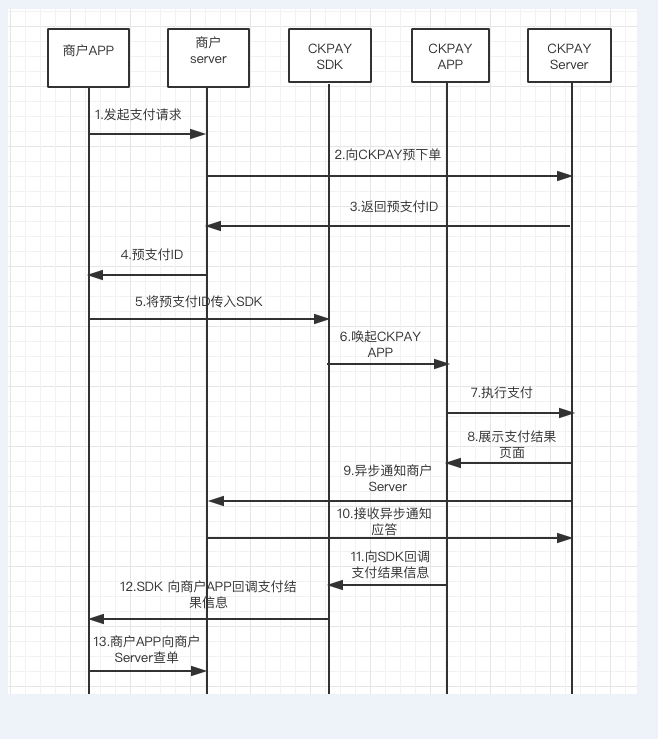
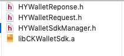
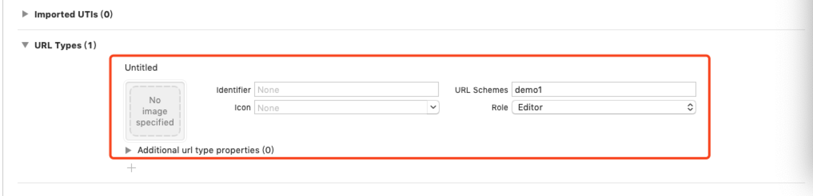
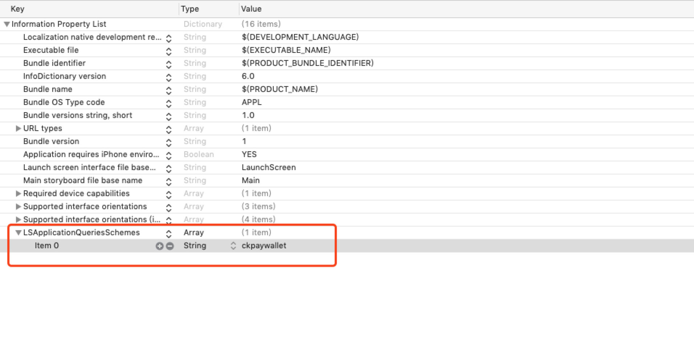

## IOS客户端 

- CKPAY APP支付iOS端接入指南
```text
本指南主要说明商户APP如何通过对接SDK来唤起CKPAY APP进行支付，支付完成后，如何实现支付结果回调，页面调转等流程。
```
- 一、交互流程



```text
1. 商户客户端向商户服务器发起支付请求。
2. 商户服务器按照CKPAY 统一下单接口要求组织相关参数，并向CKPAY服务器预下单。
3. CKPAY支付服务器收到响应后，生成预支付ID，并返回商户服务器。
4. 商户服务器将预支付ID返回商户客户端。
5. 商户客户端将预支付ID、商户平台订单号等参数，按照CKPAY SDK接口要求传入。
6. SDK将商户客户端传入的参数进行校验、并做进一步组织处理后，进行唤起CKPAY APP（此处假设商户侧用户已经安装了 CKPAY APP。如果未安装，SDK将做出相关提示，请先下载安装）。
7. CKPAY用户在确认支付金额、订单信息、收款商户等信息无误情况下，输入钱包支付密码进行支付。
8. CKPAY支付服务器完成支付扣款后，CKPAY APP向用户展示支付结果页面。
9. 同时CKPAY支付服务器将异步通知商户服务器，告知支付状态(具体通知参数，请参考支付结果通知接口)。
10. 商户服务器收到异步通知后，需要向CKPAY服务器做出接收成功应答，商户响应参数：ok 或者 success。
11. CKPAY APP向SDK回调支付结果信息。
12. SDK向商户客户端回调支付结果信息。
13. 商户客户端收到支付结果回调后，按照支付状态字段，展示于用户。此状态仅用于向用户展示，不作为发货逻辑处理依据。
```	

- 二、SDK接入步骤


1. 添加SDK依赖框架
```text
		1.JavaScriptCore.framework
		2.CoreMotion.framework
		3.CoreTelephony.framework
		4.CoreGraphics.framework
		5.SystemConfiguration.framework
		6.CFNetwork.framework
		7.libc++.1.tbd
		8.libz.1.2.5.tbd
		9.libsqlite3.0.tbd
```

2. 导入SDK

商户iOS端开发人员将以下文件导入到iOS工程，静态库文件为真机和模拟器合并库，最低兼容版本为iOS 9以上。



3. 代码对接部分

在将要唤起SDK的ViewController中添加如下代码段：

```tsxt	
HYWalletRequest * request = [HYWalletRequest new];
request.schemeStr = @"demo1";//此值一定要和工程配置的URLScheme一致,用作从CKPAYAPP跳转回商户APP时使用
request.out_trade_no = dic[@"out_trade_no"]; //商户平台订单号
request.hy_pay_id = dic[@"hy_pay_id"];//预支付ID
[HYWalletSdkManager sendReq:request completion:^(HYWalletReponse *response) {
  NSLog(@"response: %@",response.message);
}];
```  	
	
    在工程的AppDelegate文件中添加如下代码:

```
 -(BOOL)application:(UIApplication *)app openURL:(NSURL *)url options:	(NSDictionary<UIApplicationOpenURLOptionsKey,id> *)options
{
 return [HYWalletSdkManager handleOpenURL:url];
}	 
```

- 三、工程配置

1.添加URLScheme 

请在工程中的Target --> Info --> URL Types选项添加URLScheme

**注意: URLScheme 标识建议为复杂的字符串，防止和其他APP重复，导致跳转异常**
如下图:



2.在info.plist文件中添加访问APP URLScheme 白名单。在对应的字段LSApplicationQueriesSchemes中添加ckpaywallet
	
如下图:



- 四、效果演示
	
具体请参考对接资源包中的CKPAYDemo。
	
